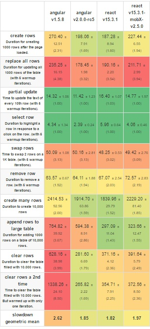

#  Angular

Вот уже три месяца кругом ходят разговоры про Angular 2.  
Но что это за зверь и как его покорить? И стоит ли оно этого вообще? Что ж, давайте обсудим.

15 сентября вышел в свет финальный релиз Angular 2, а 20 декабря вышла версия 2.4. Разработка над четвертой версией популярного фрейморвка уже ведется полным ходом и мы можем протестировать первую бету!

 Где делась версия три? Те кто следят за новостям,уже наверняка знают в чем причина, а тем кто не вкурсе - рекомендую прочитать эту <a href="http://www.infoworld.com/article/3150716/application-development/forget-angular-3-google-skips-straight-to-angular-4.html">статью</a>.

 

В этой статье я <b>не буду</b> рассказывать про  компоненты,директивы,модули и прочие вещи с которыми вы можете с легкостью ознакомиться во время прохождения <a href="https://angular.io/docs/ts/latest/tutorial/">туториала</a>.

#

# Итак,  к делу!
## Angular command line interface

 Многие из нас могут рассказывать страшные истории о том, сколько мозгов 
 webpack вам выел... 😉  Могу вас обрадовать! <b>ЭТО В ПРОШЛОМ!!!😍</b>

 <a href="https://cli.angular.io/">Интерфейс командной строки</a>
 позволяет создать приложение,которое уже работает. Вам не нужно тратить уйму часов для настройки вебпака. Для поиска всех лоадеров,для создания конфигов под разные environments! Всё это уже сделано за вас!
 

 

 Для того, чтобы начанать работать с командной строкой  - необходимо её установить.
 Сделать это очень просто!  Запоминайте!🤓
 
 `npm install -g angular-cli
`

 
После успешной установки, введите в командной строке следующий код :
 
 `ng version`

 Если всё установилось,то результат будет примерно такой :
 
`
angular-cli: 1.0.0-beta.21 `

`node: 6.9.1
`

`
os: win32 x64
`
 

Дальше всё так же просто! 
- Создать новый проект :

`
ng new <project-name>  [options]
`
- Добавить ng-cli  в уже существующий:

`
ng init 
`

После этого мы можем смело начинать писать код и не думать ни о каких других проблемах!

Более подробно про апи консоли <a href="https://cli.angular.io/reference.pdf"><b>тут</b></a>

### Итог прост. Мы сберегли кучу времени и нервов! 😤
#
# Server side rendering

 Уже много лет SPA  гуляют на просторах интернета,но поисковики так и не могут по тем или иным причинам,узнать что находится на страницах этих сайтов.
  
 Связано это с тем, что SPA  генерируют весь свой контент динамически,таким образом, зайдя на такой сайт и открыв его код чаще всего мы увидим один единственный div.
  Это не сильно вам поможет оказаться на первых строках в поисковике... Вернее совсем никак не поможет.
### У меня есть хорошие новости!
## Angular powered by Google©
И, конечно, эти ребята не могли сделать свой продукт не индексируемым для своего же поисковика. 🆘

<h2><a href="https://universal.angular.io/">Angular universal</a></h2>

На данный момент server side  рендеринг поддерживается только nodejs и... <a href="https://github.com/aspnet/JavaScriptServices">ASP.NET CORE</a> ! 😤

#

# Performance

 В один прекрасный день у нас в кабинете разгорелся жестокий холивар на эту тему.
  
 Благодаря  <a href="http://stefankrause.net/js-frameworks-benchmark4/webdriver-ts/table.html">этой табличке</a>
все остались целы :) 
 
Данные уже немного не актуальны. Angular всё таки зарелизился,да и React уже имеет версию 15.4. Если у кого-то будет желание обновить эти бенчмарки - не стесняйтесь :) 

Поберегу ваши глаза и немного повангую :)
Подозреваю,что большинство интересуют следующие герои :
 

** mobx - библиотека для управления состояниями (аналог Flux\Redux)
> Так же рекомендую посмотреть бенчмарки Vue.js :) Они есть в  таблице выше)

*** 
 # Скорость это круто...Но так ли она важна?

За этот год я встретил немало <a href="http://www.pcworld.com/article/3060622/internet/the-average-web-page-is-now-larger-doom.html">статей</a> статей, в которых люди смеются с объемов мегабайт, которыt показывают DevTools при загрузке странички.

> Почему растут размеры  одностраничных приложений?

~~Из-за разработчиков~~ Из-за модулей. 

В тот момент,когда вы пишите 

`const $= require('jquery')`

либо

`import $ from 'jquery'`

Ваш сборщик пакетов видит это как 
 1. Вытащить весь код из файла
 2. Вытащить из кода нужную зависимость
 3. Засунуть всё в бандл.

 > И что делать?

 #  <a href="https://angular.io/docs/ts/latest/cookbook/aot-compiler.html#!#tree-shaking"> Tree shaking
 </a>

 >Что такое Tree Shaking?
  
Если в двух словах,то это  фишка из ES6 модулей. Она анализирует ваш код и удаляет не использованные куски кода из библиотек и функций,тем самым уменьшая размер вашего бандла в несколько раз.
 
 При работе с Angular  сделать это очень просто.

 Необходимо использовать ES6 синтаксис:
 
 `import $ from 'jquery'`

 и выполнить  команду  из ng-cli в командной строке :

 `
 ng build --prod
 `

 После этого у вас будет оптимизированный и готовый для продакшена билд!

 Под капотом Angular command line interface использует всё тот же старый добрый вебпак,только с одним отличием... он уже настроен и готов сбилдить ваше приложение  :)

 > Могу ли я использовать Tree shaking  без Angular cli ?

 Да. Как я писал вышел,Tree shaking  это пришёл к нам из ES 6.

Например, <a href="http://rollupjs.org/"> эта штука вам поможет </a>.

Если же вы используете TypeScript версии выше 2 ,то вам вовсе не нужно сильно заморачиваться.

Просто нужно изменить несколько строк в tsconfig.json

`
{
  "compilerOptions": {
    "target": "es5",
    "module": "es2015",
    ...
  },
  ...
}
`

 Но на этом все прелести Angular не заканчиваются!

# <a href="https://angular.io/docs/ts/latest/cookbook/aot-compiler.html#">AHEAD-OF-TIME COMPLITAION</a>

> Cтоп-стоп-стоп. Какая еще компилиция? Кого компилиция? Во что компиляция? Ты о чём сейчас вобще?

    Да-да..Angular компилируется..) Правда  не только Angular,но и любой JS. 
 
 Делает он это прямо в браузере...Правда <a href="http://softwareengineering.stackexchange.com/a/291343">"компилируется"</a>  не совсем  то, о чем вы подумали.
 Браузер компилирует JavaScript  в *другой* JavaScript :)
 Когда бразуер прогружает ваши JS файлы,он сразу же начинает процесс их оптимизации.
 Это задерживает рендеринг страницы. Помимо этого,вместе с вашим  кодом на клиент вылетает куча библиотек,которые будут использованы для определенного одного шага и  только в одном месте ~~спасибо npm~~ и попросту не нужны браузеру для отображаения  контента, но они всё равно упаковываются в  бандл и выливаются на клиент.

> А AHEAD-OF-TIME что такое?

Это процесс компиляции,который происходит 
при билде проекта и дает браузеру возможность пропустить этот шаг. Это значительно увеличивает скорость загрузки.

Разницу вы можете заметить открыв DevTools и посмотреть на вкладку Network
* <a href="https://aot-examples.firebaseapp.com/hello-aot/">Сайт с использованием AOT компилятора</a>
* <a href="https://aot-examples.firebaseapp.com/hello-no-aot/">Сайт c использованием JIT компилятора</a>    

Размер бандла с использованием АОТ компилятора уменьшился в двое,а всё за счет того,что для работы приложению попросту не нужны все эти зависимости и пакеты типа @angular  и т.п.
Единоразово скомпилировав проект перед деплоем,мы избавляемся от всего лишнего мусора и получаем оптимизированный и минифицированный JavaScript.
В этом и вся магия :)

Более подробно прочитать о AOT  компиляторе можно в   <a href="https://blog.nrwl.io/angular-is-aot-worth-it-8fa02eaf64d4#.j81r5fnr3">этой</a> статье.

Angular cli умеет делать это из коробки одной простой командой 

`
ng build --aot --prod
`

Если же вы хотите прикрутить такую компиляцию без использования cli,то вам придется немного видоизменить файлик,в котором вы бутсрапаете ваше приложение.

В документации этот процесс подробно описан :)

